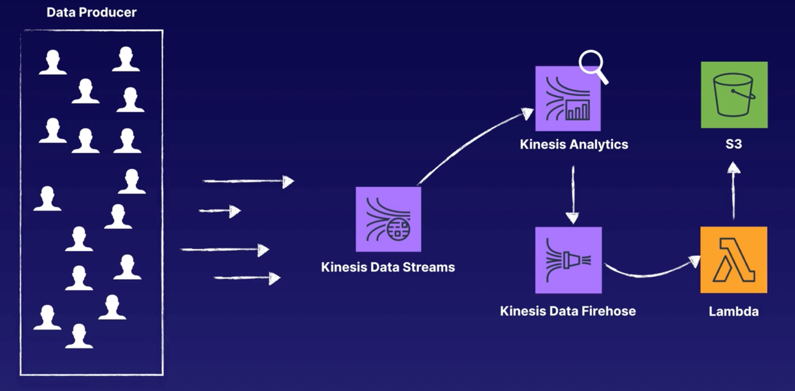

# aws-data-streaming

This is a CloudFormation template that will implement the following architecture described in [A Cloud Guru's Streaming Data Collection Lab](https://acloud.guru/course/aws-certified-machine-learning-specialty/learn/c756bf92-fc24-f757-1b0d-5072064ea51a/9cc545b4-fdcb-0a86-2948-c86fe7f7acba/watch?backUrl=%2Fcourses):

### Usage

1. Run `bash ./tools/create.sh`.
2. In the Console, open the Kinesis Analytics Application that was created and click the button "Save and Run SQL".
3. Run `python put_record_python_program.py` to stream random user data to Kinesis Streams.

### Todo

- Add Lambda resource that Firehose can use to transform the data before it hits S3.
- Template doesn't immediately start the Kinesis Analytics Application. This must be done in the Console for now. 

### Resources

- One shard should provide an upper limit of 1MB written per second, 1000 records written per second, and 2 MB per second read. This is sufficient for the one producer stream but can be increased depending on your use case.
- Data types that can be used for your SQL query are [these](https://docs.aws.amazon.com/kinesisanalytics/latest/sqlref/sql-reference-data-types.html).
- [Grant Kinesis Data Firehose Access to a S3 Bucket](https://docs.aws.amazon.com/firehose/latest/dev/controlling-access.html#using-iam-s3)
